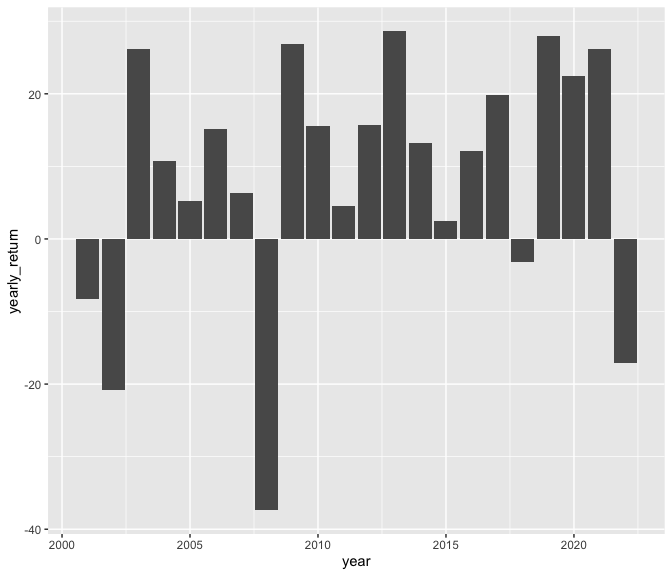

WK2_WS
================
YC
2024-01-24

- [statistics on returns](#statistics-on-returns)
- [s&&p prices](#sp-prices)

``` r
df=readRDS("DATA/wk2_stocks.rds")
str(df)
```

    ## 'data.frame':    5798 obs. of  4 variables:
    ##  $ SPY_prices : num  88.1 87.1 84.3 84.9 84.7 ...
    ##  $ SPY_returns: num  0.04804 -0.01076 -0.03264 0.00774 -0.00264 ...
    ##  $ SPY_vol    : num  88.1 87.1 84.3 84.9 84.7 ...
    ##  $ date       : Date, format: "2001-01-03" "2001-01-04" ...

## statistics on returns

- The cumulative returns of the S&P index during this period is 218.33
  %.
- The average daily returns of the S&P index during this period is 0.04
  %.
- The standard deviation of the daily returns of the S&P index during
  this period is1.22 %.

## s&&p prices

``` r
library(tidyverse)
ggplot(data=df,aes(x=date,y=SPY_prices))+geom_line()
```

<!-- -->

``` r
df%>% mutate (year=year(date))%>%filter(year<2023)%>%group_by(year)%>%summarize(yearly_return=round(sum(SPY_returns)*100,2))%>%ggplot(aes(x=year,y=yearly_return))+geom_col()
```

<!-- -->
